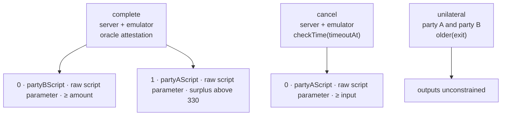

# Escrow

Party A locks coins. An oracle releases `amount` to party B, or the timeout returns the coins to party A.

`partyAScript` and `partyBScript` are the 32-byte witness program an output reports.

The contract commits `sha256` of the one message the oracle signs. A surplus of 330 sats or less is unconstrained, so a slight overfund cannot block the release. Outputs take the whole VTXO; miner fees come from a server input. `complete` and `cancel` require a single input so two escrow coins cannot share one payout.

`cancel` reads the emulator clock in Unix seconds through `checkTime`. arkd rebuilds an offchain spend of this leaf with nLockTime 0, so the check is the emulator's clock. The ASP runs that clock and can accept a cancel before `timeoutAt`.
