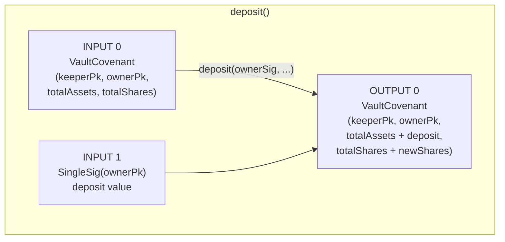
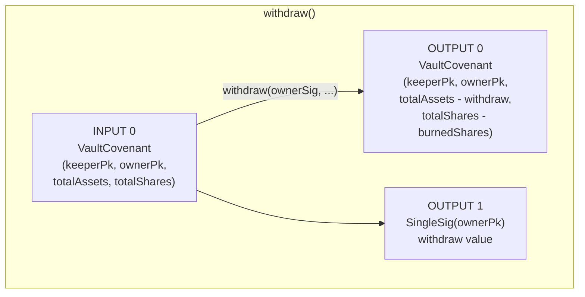
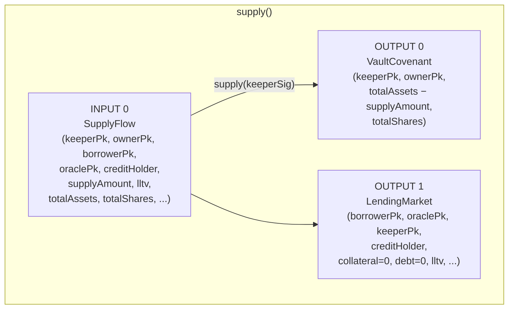
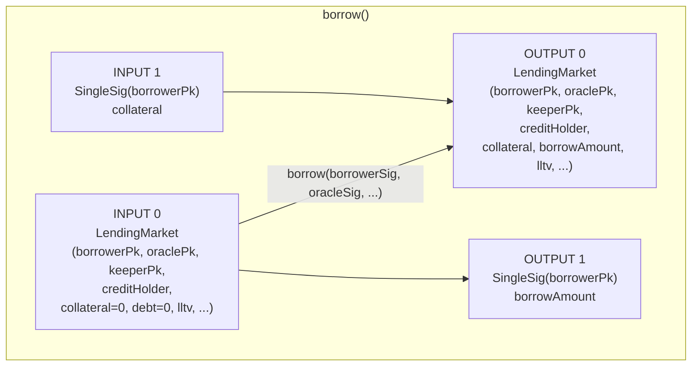
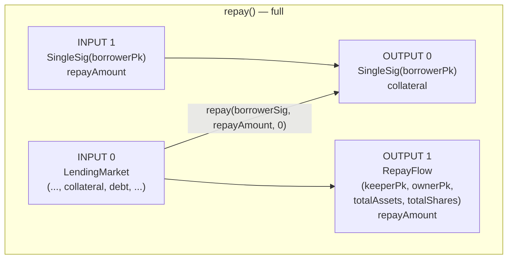
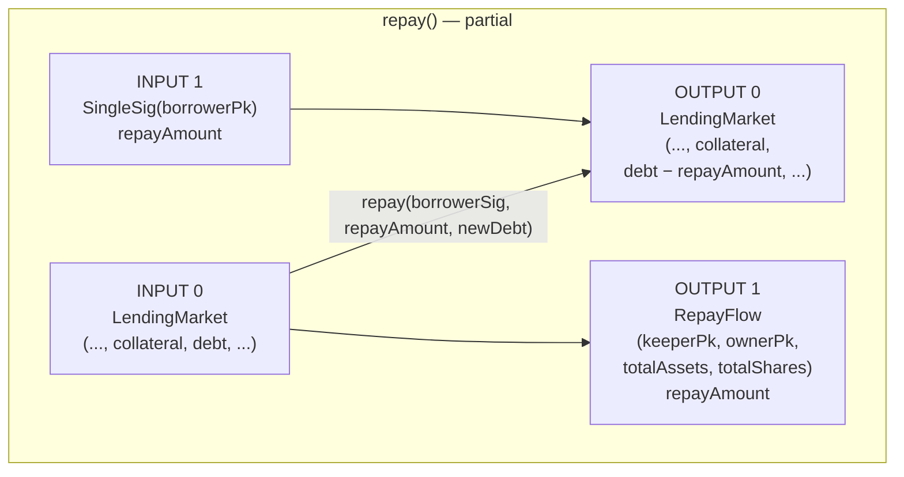
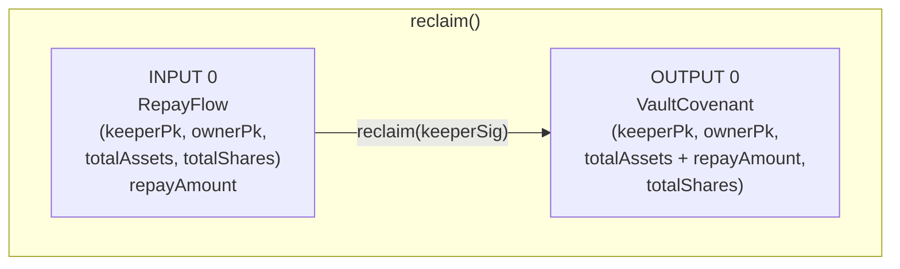
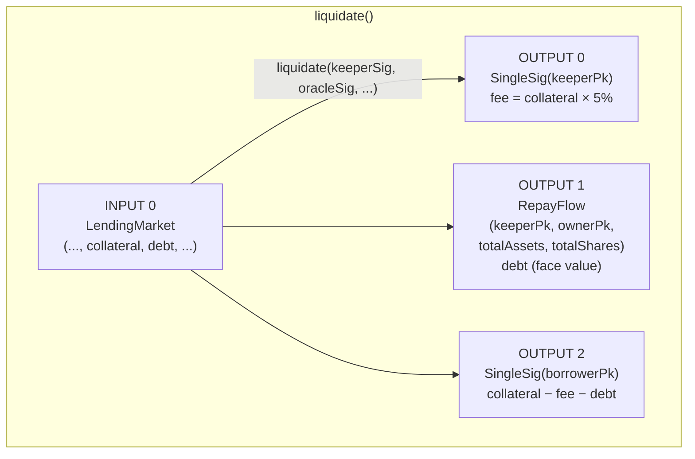
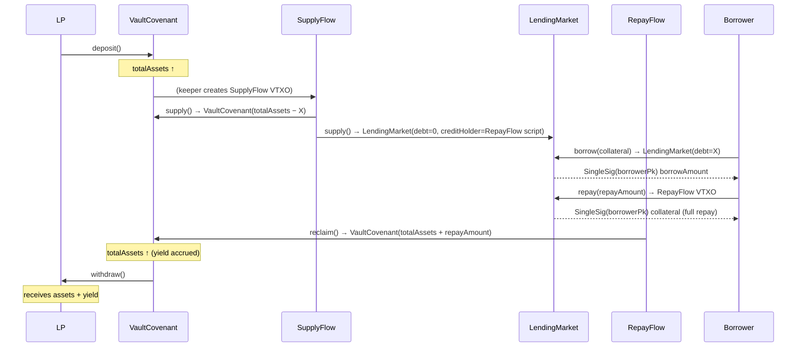

# Vault + Lending — UTXO Spending Flows

Each diagram shows one transaction: inputs on the left, outputs on the right.
Covenant names are the Arkade contracts. `→` means "spending path / function called".

---

## 1. Deposit (LP → Vault)

---

## 2. Withdraw (Vault → LP)

---

## 3. Supply (Vault → LendingMarket)

`creditHolder` is the precomputed scriptPubKey of `RepayFlow(keeperPk, ownerPk, totalAssets − supplyAmount, totalShares)`.

---

## 4. Borrow (LendingMarket → Borrower)

---

## 5a. Full Repay (Borrower closes position)

---

## 5b. Partial Repay (Borrower reduces debt)

---

## 6. Reclaim (RepayFlow → Vault)

---

## 7. Liquidation (Keeper closes underwater position)

---

## 8. End-to-end lifecycle

---

## Key invariants

| Invariant | Enforced by |
|---|---|
| Repayment always lands in RepayFlow, never a pubkey | `creditHolder` is `bytes32` in LendingMarket; repay sets `outputs[1].scriptPubKey == creditHolder` |
| RepayFlow script committed at supply time | Off-chain: `creditHolder = scriptPubKey(RepayFlow(keeperPk, ownerPk, totalAssets − supplyAmount, totalShares))` |
| Vault totalAssets only increases on reclaim by actual received value | `returnAmount = tx.input.current.value` in RepayFlow |
| Borrower collateral ratio checked against oracle | `collateral × price / 10000 >= borrowAmount × 10000 / lltv` |
| Weights sum to 10000 in CompositeRouter | `weightSum == 10000` enforced on-chain |
| No value escapes liquidation waterfall | `residual >= 0` guard + exact value checks on all outputs |
