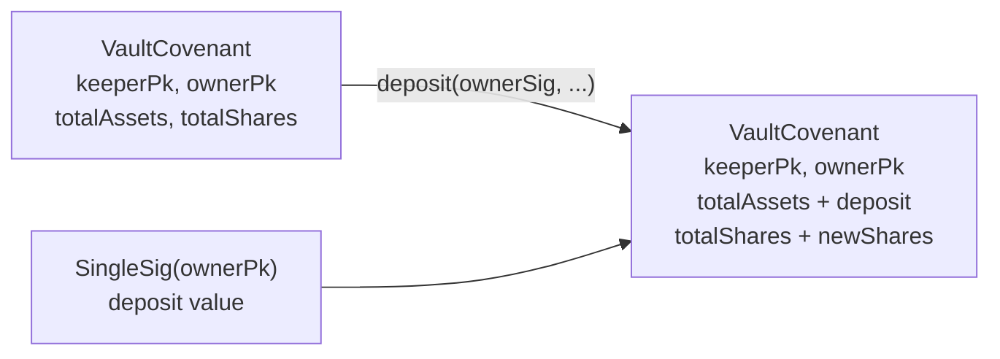
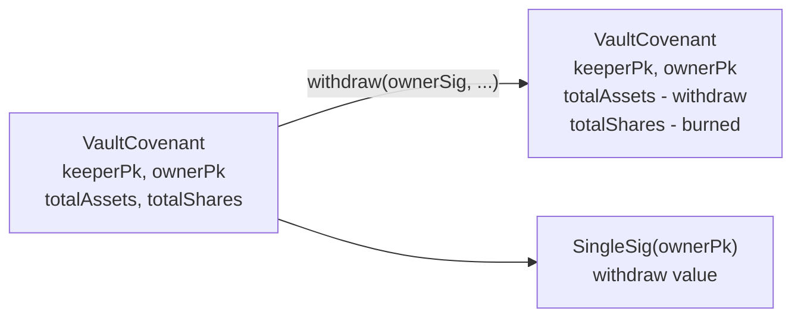
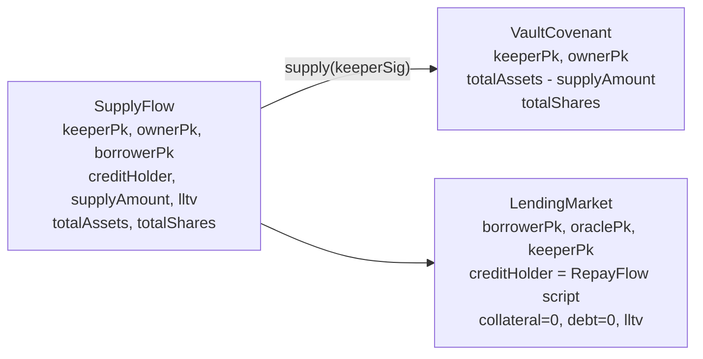
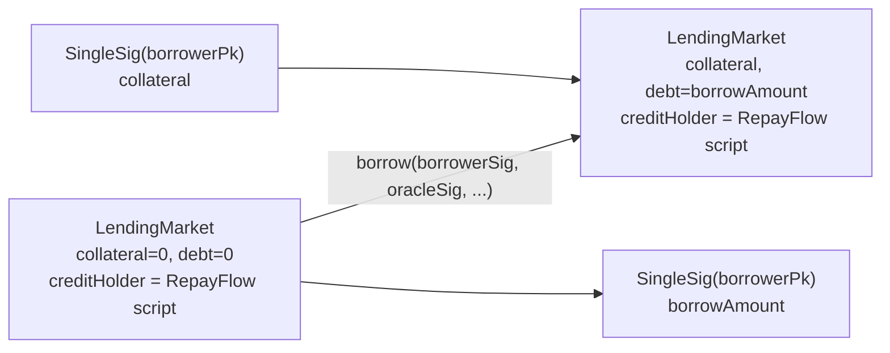
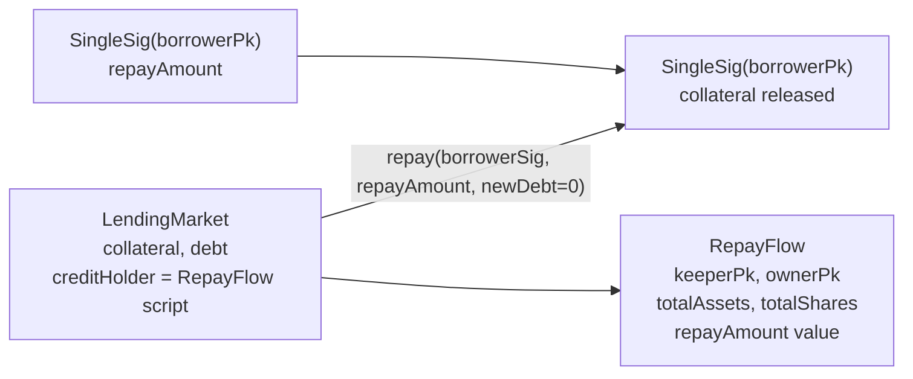
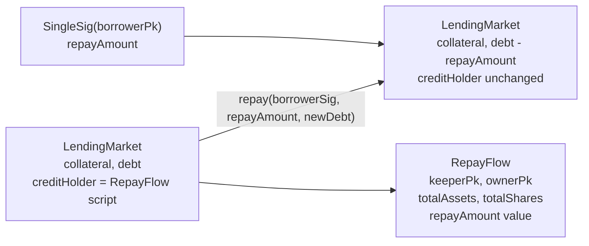
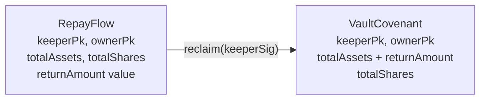
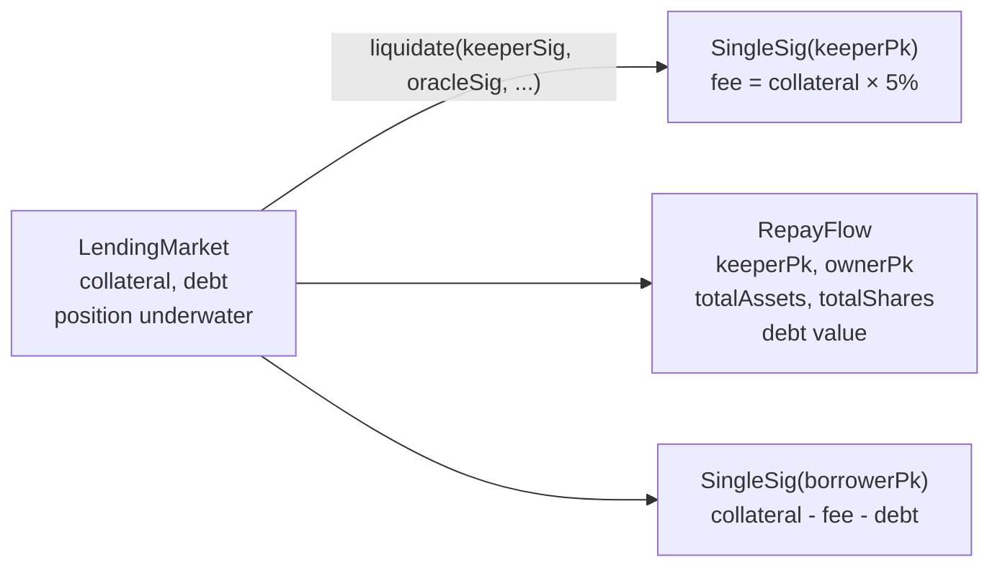
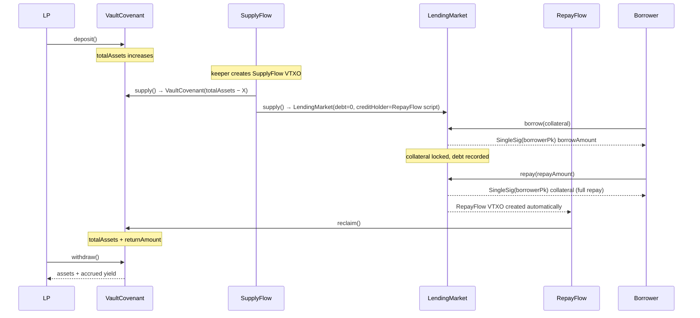

# Vault + Lending — UTXO Spending Flows

Each diagram shows one transaction. Inputs are on the left, outputs on the right.
`fn(...)` labels on edges name the covenant function being executed.

---

## 1. Deposit (LP → Vault)

---

## 2. Withdraw (Vault → LP)

---

## 3. Supply (Vault → LendingMarket)

`creditHolder` = precomputed `scriptPubKey` of `RepayFlow(keeperPk, ownerPk, totalAssets − supplyAmount, totalShares)`

---

## 4. Borrow (LendingMarket → Borrower)

---

## 5a. Full Repay (Borrower closes position)

---

## 5b. Partial Repay (Borrower reduces debt)

---

## 6. Reclaim (RepayFlow → Vault)

`returnAmount` is derived from `tx.input.current.value` — no keeper input.

---

## 7. Liquidation (Keeper closes underwater position)

---

## 8. End-to-end lifecycle

---

## Key invariants

| Invariant | Enforced by |
|---|---|
| Repayment always lands in RepayFlow, never a bare pubkey | `creditHolder` is `bytes32` in LendingMarket; `repay` checks `outputs[1].scriptPubKey == creditHolder` |
| RepayFlow script committed at supply time | Off-chain: `creditHolder = scriptPubKey(RepayFlow(keeperPk, ownerPk, totalAssets − supplyAmount, totalShares))` |
| Vault accounting bound to actual settled value | `returnAmount = tx.input.current.value` in RepayFlow — no caller input |
| Collateral ratio enforced on every borrow | `collateral × price / 10000 >= borrowAmount × 10000 / lltv` |
| Strategy weights sum to 10000 | `weightSum == 10000` on-chain in CompositeRouter |
| Liquidation waterfall is solvent | `residual >= 0` guard before distributing outputs |
